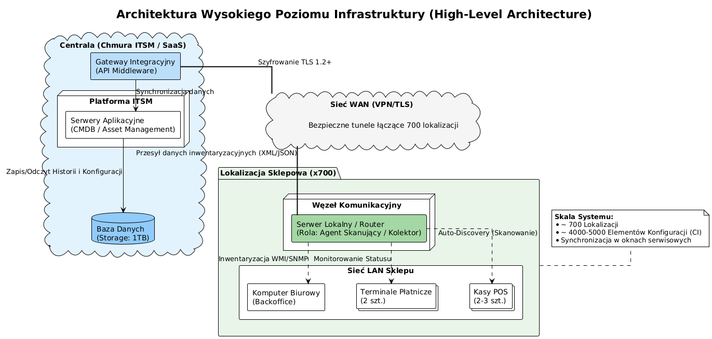
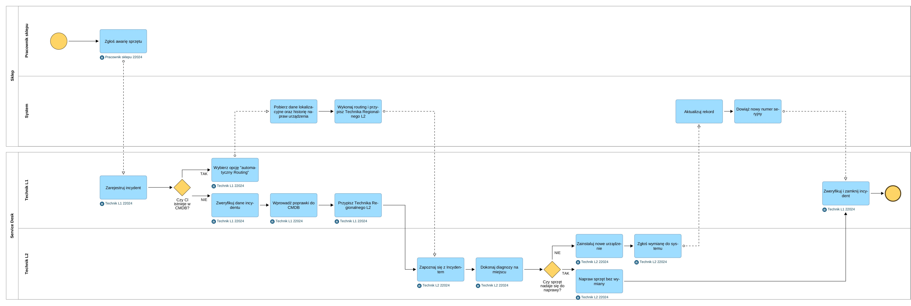
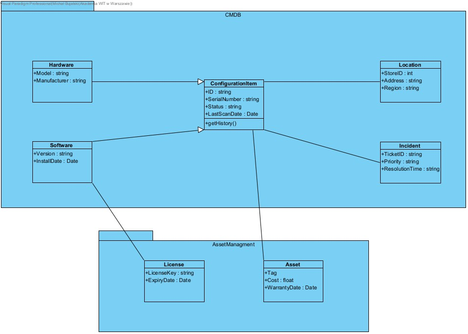

# 🛒 Retail Chain ITSM System Design (700 Stores)

## 📌 Project Overview
**Role:** Sole Analyst & System Architect
**Scope:** IT Service Management (ITSM) implementation for a distributed retail network.

This project focuses on designing a comprehensive **IT Asset & Configuration Management** ecosystem for a retail chain consisting of **700 grocery stores**. The primary goal was to ensure business continuity, minimize downtime (MTTR), and automate asset tracking across dispersed locations using **ITIL v4** standards.

**Key Objectives:**
* **Automation:** Geographic routing of incidents to local technicians based on store location.
* **Visibility:** Unifying Financial (Asset) and Technical (CI) data in a single CMDB.
* **Efficiency:** Reducing Mean Time To Resolve (MTTR) to < 1.5h.

---

## 🏗️ 1. High-Level Architecture
The system architecture connects the Central HQ (Cloud ITSM) with local store infrastructure via secure VPN/TLS tunnels. It utilizes local "Communication Nodes" for auto-discovery of hardware (POS, Terminals).

---

## 🔄 2. Incident Management Process (BPMN)
Designed a workflow that leverages CMDB data to automate incident handling.
* **Key Feature:** The system automatically checks the CMDB for the device's location and routes the ticket to the nearest Field Technician (L2), bypassing manual dispatch.

---

## 🗃️ 3. Data Model & CMDB Structure (UML)
A normalized database schema designed to separate financial lifecycles from technical status while maintaining a link between them.
* **Configuration Item (CI):** Tracks technical status (`Serial Number`, `LastScanDate`).
* **Asset:** Tracks financial data (`Cost`, `Warranty`, `Depreciation`).

---

## 📋 Functional Requirements Highlights

### 🔹 CMDB & Configuration [WF-CMDB]
* **Hierarchical Relations:** System maps dependencies (e.g., *POS Terminal* depends on *Store Server*).
* **Auto-Discovery:** Automatic import of hardware details from local store agents.

### 🔹 Service Desk Support [WF-INC]
* **Geographic Routing:** Automatic assignment of tickets to the appropriate Regional Support Group based on the store's physical address found in the CMDB.
* **Impact Analysis:** Dashboard visualization showing how a specific device failure impacts store sales targets.

### 🔹 Asset Management [WF-AM]
* **Lifecycle Tracking:** Monitoring assets from procurement (Purchase Order) to disposal (End of Life).
* **TCO Calculation:** Aggregating purchase costs + repair costs to calculate Total Cost of Ownership.

## 🛠️ Tools & Methodologies
* **Modeling:** Visual Paradigm (BPMN 2.0, UML 2.5).
* **Framework:** ITIL v4 (Service Design, Service Transition).
* **Tech Stack Concepts:** REST API Integration, SQL Database Design, TLS Security Standards.

---
*Created by Michał Bujalski*
